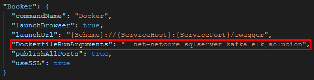
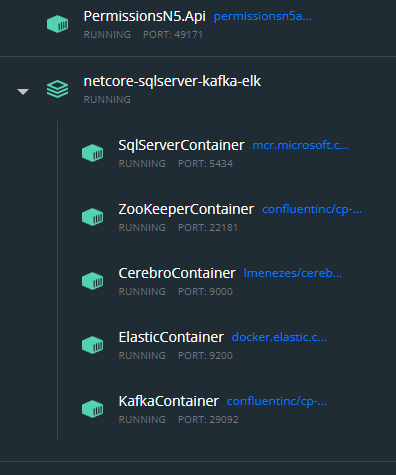
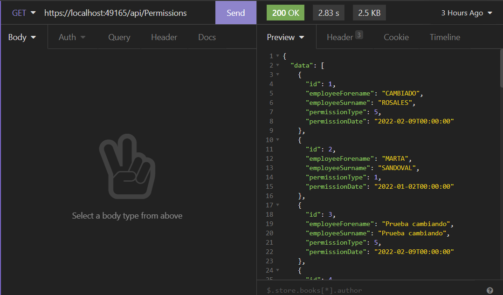
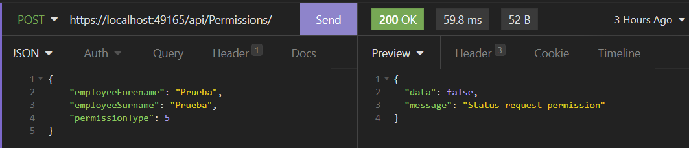
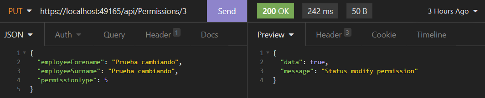
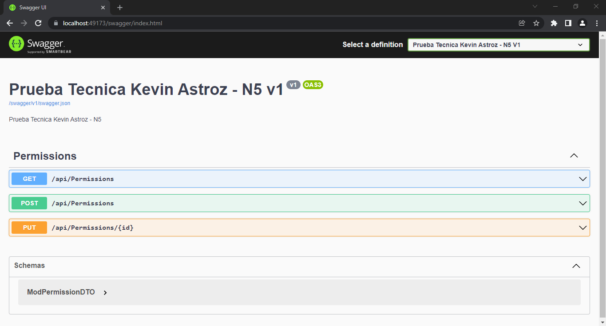
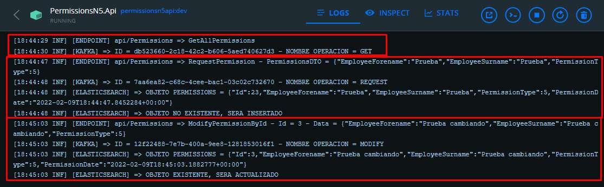
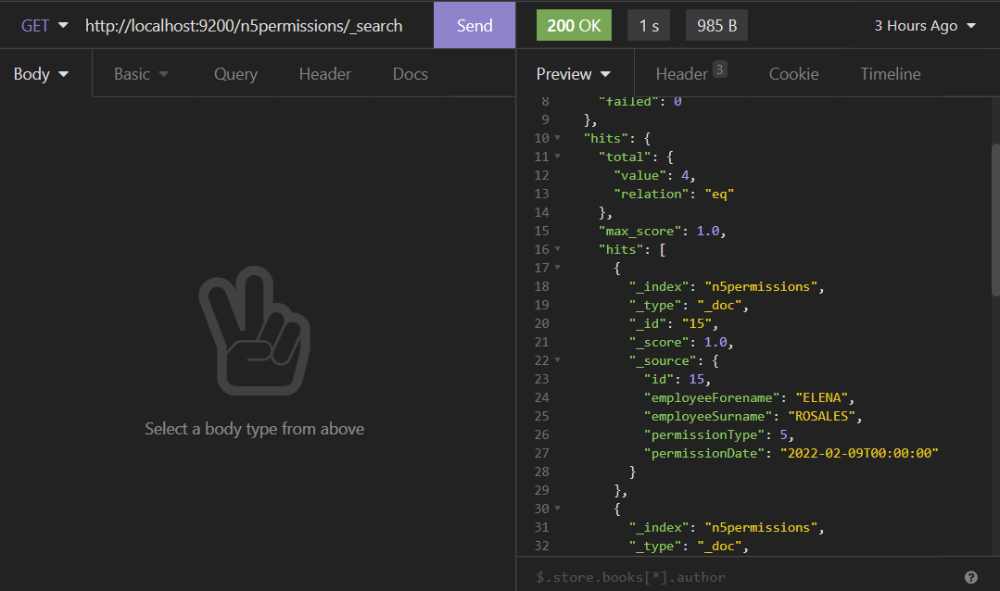
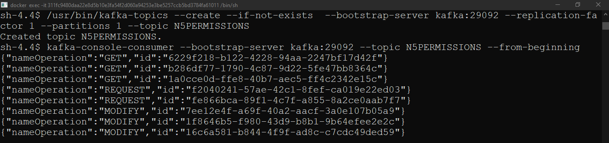

# .NetCore-SqlServer-Kafka-ELK

Tener en cuenta:

1. Si se quiere resetear la persistencia de datos entrar a la carpeta Containers y borrar lo que se encuentra dentro de elk, kafka, sqlserver

2. ejecutar primero docker-compose y siguiente orden

levanta infraestructura
> docker-compose up

resetea base de datos y deja datos de pruebas en ella
> powershell 01_CreateDb.ps1

crea indice en elasticsearch
> powershell 02_CreateIndex.ps1

entrar a la shell de kafka y crear un topic
> /usr/bin/kafka-topics --create --if-not-exists  --bootstrap-server kafka:29092 --replication-factor 1 --partitions 1 --topic N5PERMISSIONS

entrar a la shell de kafka y obtener mensajes enviados
> kafka-console-consumer --bootstrap-server kafka:29092 --topic N5PERMISSIONS --from-beginning

verificar que en el launchSetting.json se agrega el contenedor a la red del docker-compuse

## Contenedores

## Endpoints

GetPermissions

RequestPermissions

ModifyPermissions

## Documentacion de API

## Logs de webapi

## Indice elasticsearch

## Mensajes kafka
